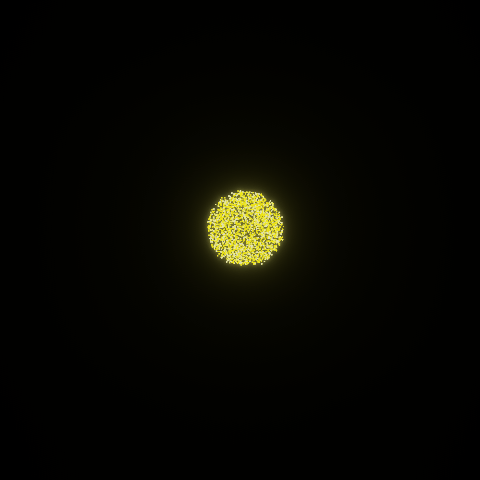

# 🎆 Bevy Hanabi

[](./LICENSE)
[](https://docs.rs/bevy_hanabi)
[](https://crates.io/crates/bevy_hanabi)
[](https://github.com/djeedai/bevy_hanabi/actions/workflows/ci.yaml)
[](https://coveralls.io/github/djeedai/bevy_hanabi?branch=main)
[](https://github.com/bevyengine/bevy/blob/main/docs/plugins_guidelines.md#main-branch-tracking)

🎆 Hanabi — a GPU particle system for the Bevy game engine.



## Overview

The Hanabi particle system is a modern GPU-based particle system for the Bevy game engine. It focuses on scale to produce stunning visual effects (VFX) in real time, offloading most of the work to the GPU, with minimal CPU intervention. The design is inspired by modern particle systems found in other industry-leading game engines.

🚧 _This project is under heavy development, and is currently lacking both features and performance / usability polish. However, for moderate-size effects, it can already be used in your project. Feedback and contributions on both design and features are very much welcome._

🎆 Hanabi makes heavy use of compute shaders to offload work to the GPU in a performant way. Support for compute shaders on the `wasm` target (WebAssembly) is available as of v0.13 (not yet published), and only through WebGPU. See the [WebAssembly support](./docs/wasm.md) documentation for details.

## Usage

The 🎆 Bevy Hanabi plugin is compatible with Bevy versions >= 0.6; see [Compatible Bevy versions](#compatible-bevy-versions).

### Add the dependency

Add the `bevy_hanabi` dependency to `Cargo.toml`:

```toml
[dependencies]
bevy_hanabi = "0.12"
```

See also [Features](#features) below for the list of supported features.

### System setup

Add the `HanabiPlugin` to your app:

```rust
use bevy_hanabi::prelude::*;

App::default()
    .add_plugins(DefaultPlugins)
    .add_plugins(HanabiPlugin)
    .run();
```

### Create an effect asset

Create an `EffectAsset` describing a visual effect:

```rust
fn setup(mut effects: ResMut<Assets<EffectAsset>>) {
  // Define a color gradient from red to transparent black
  let mut gradient = Gradient::new();
  gradient.add_key(0.0, Vec4::new(1., 0., 0., 1.));
  gradient.add_key(1.0, Vec4::splat(0.));

  // Create a new expression module
  let mut module = Module::default();

  // On spawn, randomly initialize the position of the particle
  // to be over the surface of a sphere of radius 2 units.
  let init_pos = SetPositionSphereModifier {
      center: module.lit(Vec3::ZERO),
      radius: module.lit(2.),
      dimension: ShapeDimension::Surface,
  };

  // Also initialize a radial initial velocity to 6 units/sec
  // away from the (same) sphere center.
  let init_vel = SetVelocitySphereModifier {
      center: module.lit(Vec3::ZERO),
      speed: module.lit(6.),
  };

  // Initialize the total lifetime of the particle, that is
  // the time for which it's simulated and rendered. This modifier
  // is almost always required, otherwise the particles won't show.
  let lifetime = module.lit(10.); // literal value "10.0"
  let init_lifetime = SetAttributeModifier::new(
      Attribute::LIFETIME, lifetime);

  // Every frame, add a gravity-like acceleration downward
  let accel = module.lit(Vec3::new(0., -3., 0.));
  let update_accel = AccelModifier::new(accel);

  // Create the effect asset
  let effect = EffectAsset::new(
    // Maximum number of particles alive at a time
    32768,
    // Spawn at a rate of 5 particles per second
    Spawner::rate(5.0.into()),
    // Move the expression module into the asset
    module
  )
  .with_name("MyEffect")
  .init(init_pos)
  .init(init_vel)
  .init(init_lifetime)
  .update(update_accel)
  // Render the particles with a color gradient over their
  // lifetime. This maps the gradient key 0 to the particle spawn
  // time, and the gradient key 1 to the particle death (10s).
  .render(ColorOverLifetimeModifier { gradient });

  // Insert into the asset system
  let effect_handle = effects.add(effect);
}
```

### Spawn a particle effect

Use a `ParticleEffect` to create an effect instance from an existing asset. The simplest way is to use the `ParticleEffectBundle` to ensure all required components are spawned together.

```rust
commands
    .spawn(ParticleEffectBundle {
        effect: ParticleEffect::new(effect_handle),
        transform: Transform::from_translation(Vec3::Y),
        ..Default::default()
    });
```

## Examples

See the [`examples/`](https://github.com/djeedai/bevy_hanabi/tree/4874c48f2d92c9a8a1f980bf808add9378c74402/examples) folder.

A web demo (using the WebAssembly target) showing all examples is availabe in the [`examples/wasm/`](./examples/wasm/) folder. You can open `index.html` in any browser to see a GIF of all the examples. Running the actual WebAssembly example however requires serving the files with an HTTP server. If you have NodeJS installed, you can do that for example by running `npx http-server examples/wasm`.

Note for Linux users: The examples build with the `bevy/x11` feature by default to enable support for the X11 display server. If you want to use the Wayland display server instead, add the `bevy/wayland` feature.

## Feature List

This list contains the major fixed features provided by 🎆 Hanabi. Beyond that, with the power of the [Expressions API](https://docs.rs/bevy_hanabi/0.12.2/bevy_hanabi/graph/expr/index.html), visual effect authors can further customize their effects by assigning individual particle attributes (position, color, _etc._).

- Spawn
  - [x] Constant rate
  - [x] One-time burst
  - [x] Repeated burst
  - [x] Spawner resetting
  - [x] Spawner activation/deactivation
  - [x] Randomized spawning parameters
- Initialize
  - [x] Constant position
  - [x] Position over shape
    - [ ] cube
    - [x] circle
    - [x] sphere
    - [x] cone / truncated cone (3D)
    - [ ] plane
    - [ ] generic mesh / point cloud (?)
  - [x] Random position offset
  - [x] Velocity over shape (with random speed)
    - [x] circle
    - [x] sphere
    - [x] tangent
  - [x] Constant/random per-particle color
  - [x] Constant/random per-particle size
  - [x] Constant/random par-particle age and lifetime
- Update
  - [x] Simulation condition
    - [x] Always, even when hidden
    - [x] Only when visible
  - [x] Motion integration (Euler)
  - [x] Apply forces and accelerations
    - [x] Constant acceleration (gravity)
    - [x] Radial acceleration
    - [x] Tangent acceleration
    - [x] Force field
    - [x] Linear drag
  - [ ] Collision
    - [ ] Shape
      - [ ] plane
      - [ ] cube
      - [ ] sphere
    - [ ] Depth buffer
  - [x] Allow/deny despawn box
  - [x] Lifetime
  - [x] Size change over lifetime
  - [x] Color change over lifetime
- Render
  - [x] Quad
    - [x] Textured
  - [ ] Generic 3D mesh
  - [x] Deformation
    - [x] Stretch alongside velocity
    - [x] Trails / Ribbons
  - [x] Camera support
    - [x] Render layers
    - [x] 2D cameras ([`Camera2dBundle`](https://docs.rs/bevy/0.14.0/bevy/core_pipeline/core_2d/struct.Camera2dBundle.html)) only
    - [x] 3D cameras ([`Camera3dBundle`](https://docs.rs/bevy/0.14.0/bevy/core_pipeline/core_3d/struct.Camera3dBundle.html)) only
    - [x] Simultaneous dual 2D/3D cameras
    - [x] Multiple viewports (split screen)
    - [x] HDR camera and bloom
  - [x] Size and orient particles
    - [x] Face camera (Billboard)
    - [x] Face constant direction
    - [x] Orient alongside velocity
    - [x] Screen-space size (projection independent)
- Debug
  - [x] GPU debug labels / groups
  - [ ] Debug visualization
    - [ ] Position magnitude
    - [ ] Velocity magnitude
    - [ ] Age / lifetime

## Features

🎆 Bevy Hanabi supports the following cargo features:

| Feature | Default | Description |
|---|:-:|---|
| `2d` | ✔ | Enable rendering through 2D cameras ([`Camera2dBundle`](https://docs.rs/bevy/0.14.0/bevy/core_pipeline/core_2d/struct.Camera2dBundle.html)) |
| `3d` | ✔ | Enable rendering through 3D cameras ([`Camera3dBundle`](https://docs.rs/bevy/0.14.0/bevy/core_pipeline/core_3d/struct.Camera3dBundle.html)) |
| `serde`* | ✔ | Use `serde` to derive `Serialization` and `Deserialization` on asset-related types. |

(*) `serde` is not compatible with WASM (due to the `typetag` dependency not being available on `wasm`).

For optimization purpose, users of a single type of camera can disable the other type by skipping default features in their `Cargo.toml`. For example to use only the 3D mode:

```toml
bevy_hanabi = { version = "0.12", default-features = false, features = [ "3d", "serde" ] }
```

## Compatible Bevy versions

The `main` branch is compatible with the latest Bevy release.

Compatibility of `bevy_hanabi` versions:

| `bevy_hanabi` | `bevy` |
| :--           | :--    |
| `0.12`        | `0.14` |
| `0.10`-`0.11` | `0.13` |
| `0.8`-`0.9`   | `0.12` |
| `0.7`         | `0.11` |
| `0.6`         | `0.10` |
| `0.5`         | `0.9`  |
| `0.3`-`0.4`   | `0.8`  |
| `0.2`         | `0.7`  |
| `0.1`         | `0.6`  |

## License

🎆 Hanabi is dual-licensed under either:

- MIT License ([`LICENSE-MIT`](./LICENSE-MIT) or <http://opensource.org/licenses/MIT>)
- Apache License, Version 2.0 ([`LICENSE-APACHE2`](./LICENSE-APACHE2) or <http://www.apache.org/licenses/LICENSE-2.0>)

at your option.

`SPDX-License-Identifier: MIT OR Apache-2.0`
